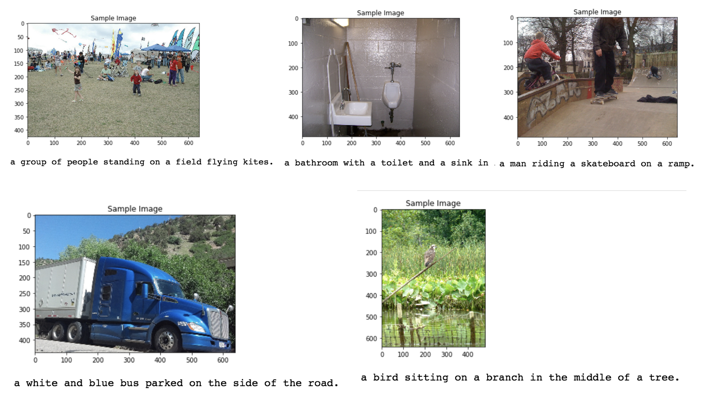

# Automatic Image Captioning

## Project Objective

In this project, I'll create a neural network architecture consisting of both CNNs and LSTMs to automatically generate captions from images.

## Getting the Files

### Download the Code

You can download this folder of code [here](https://tugan0329.bitbucket.io/downloads/udacity/cv/p2-automatic-image-captioning.zip)

### Data

The Microsoft **C**ommon **O**bjects in **CO**ntext (MS COCO) dataset is a large-scale dataset for scene understanding.  The dataset is commonly used to train and benchmark object detection, segmentation, and captioning algorithms.  

You can read more about the dataset on the [website](http://cocodataset.org/#home) or in the [research paper](https://arxiv.org/pdf/1405.0312.pdf).

To obtain and explore the dataset, you can use either the [COCO API](https://github.com/cocodataset/cocoapi), or run the [Dataset notebook](0_Dataset.ipynb).

### Model Download

The core architecture used to achieve this task follows an encoder-decoder architecture, where the encoder is a pretrained ResNet CNN on ImageNet, and the decoder is a basic one-layer LSTM.

You can use my pre-trained model for your own experimentation. To use it, [download](https://www.dropbox.com/sh/z95hjvylmqqzqr0/AABRRLCVHzRSnUico5xV_-Y0a?raw=1). After downloading, unzip the file and place the contained pickle models under the subdirectory `models`.

Please feel free to experiment with alternative architectures, such as bidirectional LSTM with attention mechanisms.

## Result

Here are some visualizations of the facial recognition, keypoints detection, CNN feature maps, and interesting sunglasses layover applications:

## Dependencies

Before you can experiment with the code, you'll have to make sure that you have all the libraries and dependencies required to support this project. You will mainly need Python 3, PyTorch and its torchvision, OpenCV, Matplotlib. You can install many dependencies using `pip3 install -r requirements.txt`.

