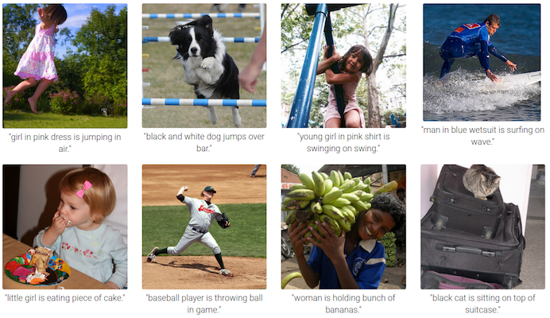

# Automatic Image Captioning

## Project Objective

In this project, I'll create a neural network architecture consisting of both CNNs and LSTMs to automatically generate captions from images.

## Result
This project is still under development. Stay tuned.
